<h1 align="center">Laracamp</h1>

<div align="center">

&nbsp;
&nbsp;
&nbsp;
&nbsp;
&nbsp;
&nbsp;

</div>


<p align="center">This repository is web application that aims to provide various features such as authentication, authorization, payment gateway, and email integration. This app is built using Laravel, Breeze (Authentication and Authorization), Socialite (OAuth Google), Midtrans (Payment Gateway), Mailtrap (Email), Docker</p>

## Table of Contents

-   [Tech Stack](#tech-stack)
-   [Entity Relationship Diagram](#entity-relationship-diagram-erd)
-   [Running on Localhost](#running-on-localhost)
    -   [Clone this repository](#clone-this-repository)
    -   [Copy & fill .env](#copy--fill-env)
    -   [Application URL](#application-url)
    -   [Database Configuration](#database-configuration)
    -   [Email Configuration](#email-configuration)
    -   [OAuth Google Configuration](#oauth-google-configuration)
    -   [Midtrans Payment Gateway Configuration](#midtrans-payment-gateway-configuration)
    -   [Install dependency package](#install-dependency-package)
    -   [Generate key](#generate-key)
    -   [Running the migration and seeder](#running-the-migration-and-seeder)
    -   [Running the application](#running-the-application)
-   [Deployment](#deployment)
    -   [Container (Docker Compose)](#container-docker-compose)
        -   [Setup Docker](#setup-docker)
        -   [Setup .env before build the image](#setup-env-before-build-the-image)
        -   [Build and run the container](#build-and-run-the-container)
        -   [Setup container app (laravel)](#setup-container-app-laravel)
    -   [Running on Host or Virtual Private Server (VPS)](#running-on-host-or-virtual-private-server-vps)
        -   [Update Repository & Upgrade Package](#update-repository--upgrade-package)
        -   [Install necessary package](#install-necessary-package)
        -   [Install composer](#install-composer)
        -   [Configure MariaDB](#configure-mariadb)
        -   [Configure Laravel](#configure-laravel)
-   [Git Flow](#git-flow)
    -   [Initialize](#initialize)
    -   [Creating new feature](#creating-new-feature)
    -   [Finish the feature](#finish-the-feature)
    -   [Create a new release](#create-a-new-release)
    -   [Finish the release](#finish-the-release)
-   [License](#license)

## Tech Stack

-   [Laravel](https://laravel.com) (`Framework`): Laravel is a PHP framework designed for web development with an expressive and elegant syntax. It provides a comprehensive ecosystem with features such as routing, sessions, caching, and authentication, enabling developers to build robust and scalable web applications easily.
-   [Breeze](https://github.com/laravel/breeze) (`Authentication and Authorization`): Laravel Breeze is a simple and minimal starter kit for authentication. It offers basic implementations for login, registration, password reset, and email verification, allowing developers to quickly and easily integrate authentication into their applications.
-   [Socialite](https://github.com/laravel/socialite) (`OAuth Google`): Laravel Socialite provides a simple and expressive way to integrate OAuth authentication with various platforms, including Google. With Socialite, you can set up user login through their Google accounts with just a few lines of code.
-   [Docker](https://www.docker.com/) (`Container`): Docker is a platform designed to help developers build, share, and run container applications. We handle the tedious setup, so you can focus on the code.
-   [Midtrans](https://midtrans.com) (`Payment Gateway`): Midtrans is a payment gateway solution that allows the integration of online payment methods into your application. Supporting various payment methods like credit cards, bank transfers, and e-wallets, Midtrans helps you securely and easily accept payments.
-   [Mailtrap](https://mailtrap.io) (`Email`): Mailtrap is an email testing service designed to capture test emails sent from your application. With Mailtrap, you can verify and analyze emails without the risk of sending them to real users, making it invaluable in development and testing environments.

## Entity Relationship Diagram (ERD)

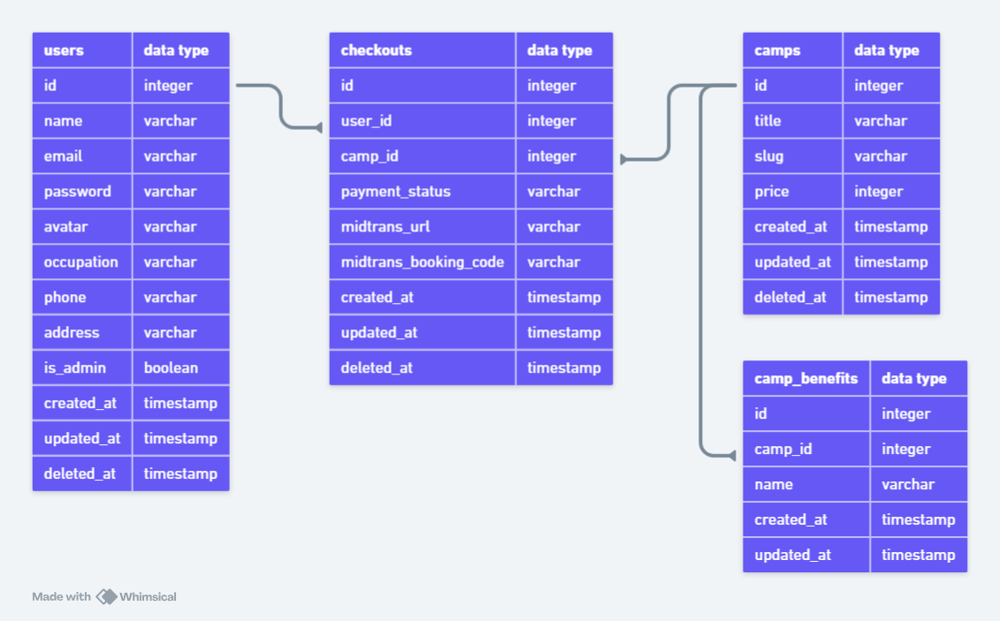

## Running on Localhost

### Clone this repository

> **NOTE**: If you are using Laragon or XAMPP you can specify the clone directory destination to your `www` or `htdocs`, for example
>
> ```bash
> git clone https://github.com/armandwipangestu/laracamp-bwa.git Z:/laragon/www/laracamp-bwa && cd laracamp-bwa
> ```
>
> or
>
> ```bash
> git clone https://github.com/armandwipangestu/laracamp-bwa.git C:/xampp/htdocs/laracamp-bwa && cd laracamp-bwa
> ```
>
> But if you just running using php web server you can place the clone directory anywhere

```bash
git clone https://github.com/armandwipangestu/laracamp-bwa.git && cd laracamp-bwa
```

### Copy & Fill .env

```bash
cp .env.example .env
```

After `.env.example` copied to `.env` now fill with your own configuration at this variable

### Application URL

You can change this `APP_URL` variable with your own configuration, for example if I running with laragon, I use pretty url which is will create a Virtual Host and mapping the local domain to the web server like `https://laracamp-bwa.dev`.

If you running with the php web server you can just edit this variable with this value `http://localhost:8000`

```bash
APP_URL=http://localhost
```

### Database Configuration

```bash
DB_CONNECTION=mysql
DB_HOST=127.0.0.1
DB_PORT=3306
DB_DATABASE=laravel
DB_USERNAME=root
DB_PASSWORD=
```

### Email Configuration

At this mail variable you can just signup and signin on [mailtrap.io](https://mailtrap.io) and then go to `inboxes` menu. At that page you will see the Integration Tab like this

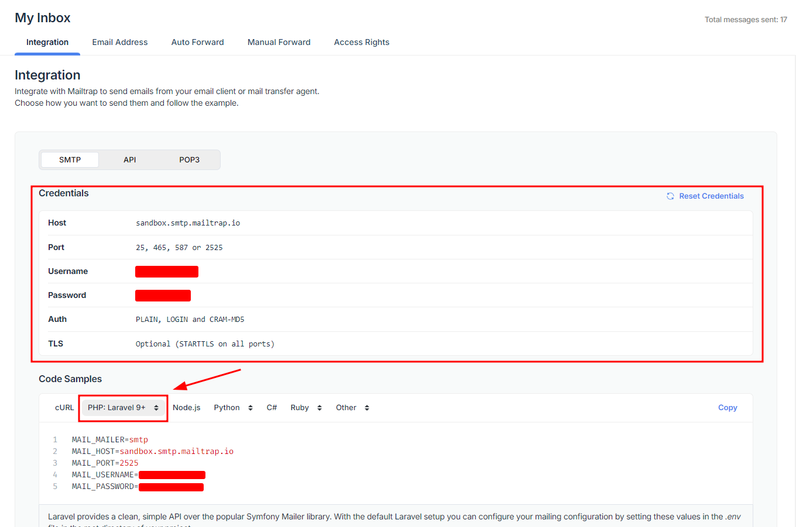

After you have your own configuration just fill the `.env` variable on mail configuration using that credentials

> **NOTE**: Optional configuration
>
> ```bash
> MAIL_ENCRYPTION=tls
> MAIL_FROM_ADDRESS=noreply@laracamp.dev
> ```

```bash
MAIL_MAILER=smtp
MAIL_HOST=mailhog
MAIL_PORT=1025
MAIL_USERNAME=null
MAIL_PASSWORD=null
MAIL_ENCRYPTION=null
MAIL_FROM_ADDRESS=null
MAIL_FROM_NAME="${APP_NAME}"
```

### OAuth Google Configuration

For setup this OAuth variable you must be create a new Google Cloud Project on [console.cloud.google.com](https://console.cloud.google.com)

After creating a Google Cloud Project, you can go to the `API & Service` > `OAuth consent screen` page like this

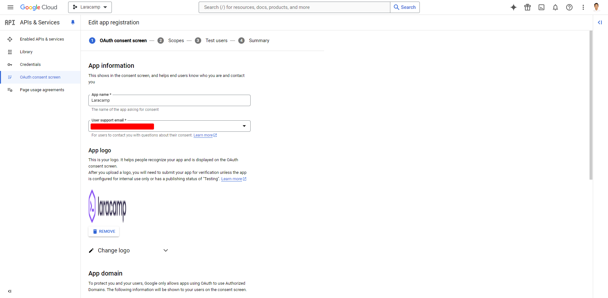

Still on that page, you can scroll down and fill list domain on `Authorized domains` section. This list domain will be use for the callback.

> **NOTE**: You can add list domain on this section, for example I use laragon pretty url so I can add `laravel-bwa.dev`. Or if you are using php web server you can add `localhost:8000`

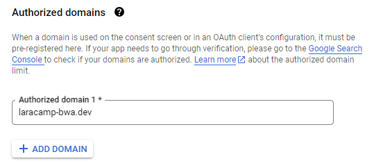

Now you can finish the OAuth Google Configuration, you can `Save and Continue` until done.

After the configuration finished, now create the OAuth client credentials at `Credentials` page

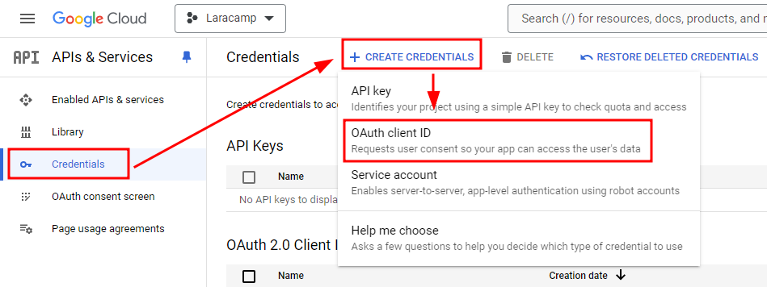

Choose `Application type` with `Web application` and fill the `Name` section. And then now fill the `Authorized redirect URIs`

> **NOTE**: You can add list domain on this section, for example I use laragon pretty url so I can add `laravel-bwa.dev`. Or if you are using php web server you can add `localhost:8000`. The domain will have endpoint with `/auth/google/callback`

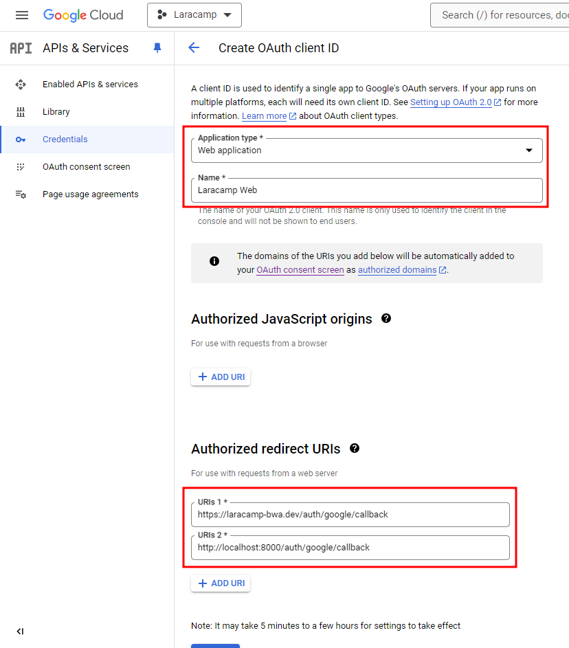

After all the configuration already fill click `Create`. Now you will see the alert with OAuth Credentials like this

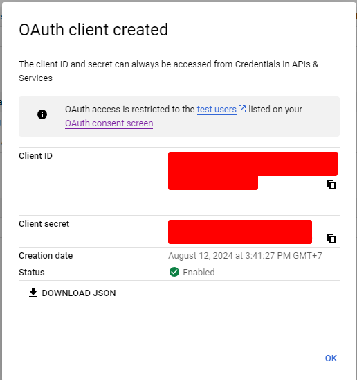

Now you can fill this variable with that credentials

> **NOTE**: For the `GOOGLE_CLIENT_REDIRECT` you can use this configuration
>
> ```bash
> GOOGLE_CLIENT_REDIRECT=https://localhost:8000/auth/google/callback
> ```
>
> or
>
> ```bash
> GOOGLE_CLIENT_REDIRECT=https://laracamp-bwa.dev/auth/google/callback
> ```

```bash
GOOGLE_CLIENT_ID=
GOOGLE_CLIENT_SECRET=
GOOGLE_CLIENT_REDIRECT=
```

### Midtrans Payment Gateway Configuration

To setup this variable you must be signup and sigin as merchant at [midtrans.com](https://midtrans.com)

After you signup and signin, go to dashboard and change the environment from `Production` to `Sandbox`

In environment `Sandbox` you can go to the `Settings` > `Access Keys` and you will see the configurations for credentials like this

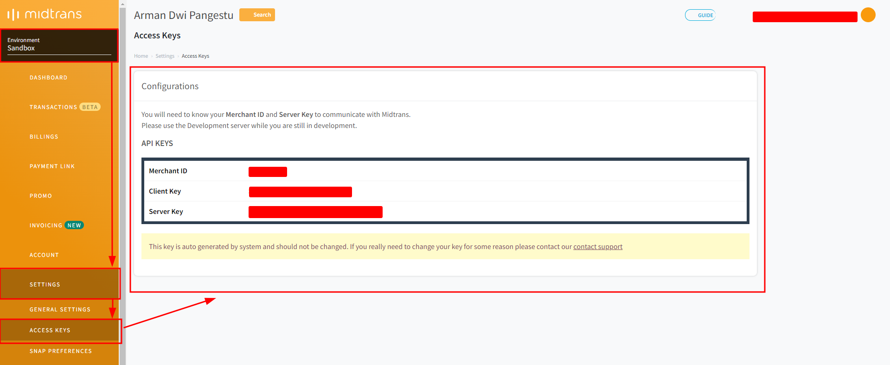

Now you can fill this variable with that configuration

> **NOTE**: Optional configuration you can change the `Snap Preferences` at `Settings`, this configuration will affect to the view when user see the payment page
>
> 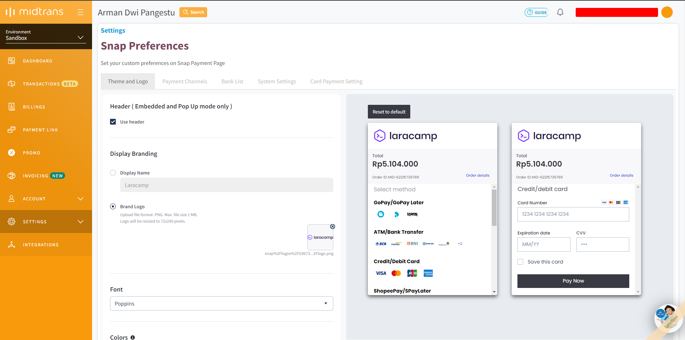

```bash
MIDTRANS_SERVER_KEY=
MIDTRANS_CLIENT_KEY=
MIDTRANS_IS_PRODUCTION=false
MIDTRANS_IS_SANITIZED=false
MIDTRANS_IS_3DS=false
```

Don't forget to add the `Notification URL` at `Settings` > `Payment`

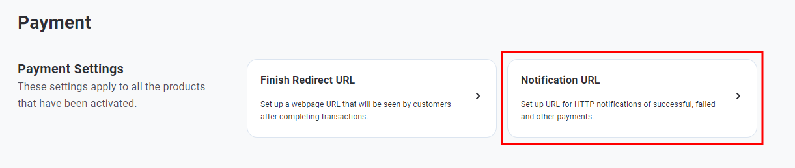

> **NOTE**: You must use the online url (accessible on the internet), you can use `ngrok` or `vscode` port forwarding

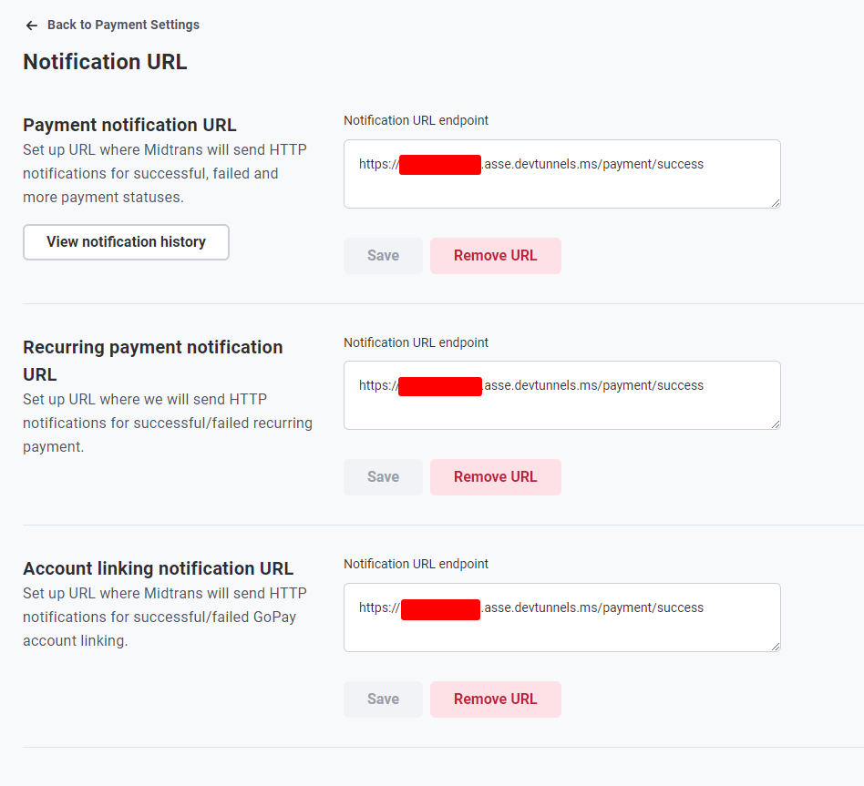

> **NOTE**: If you use snap preferences, you must set the redirect url at this menu `Settings` > `Snap Preferences` > `System Settings` > `Redirection Settings`
>
> 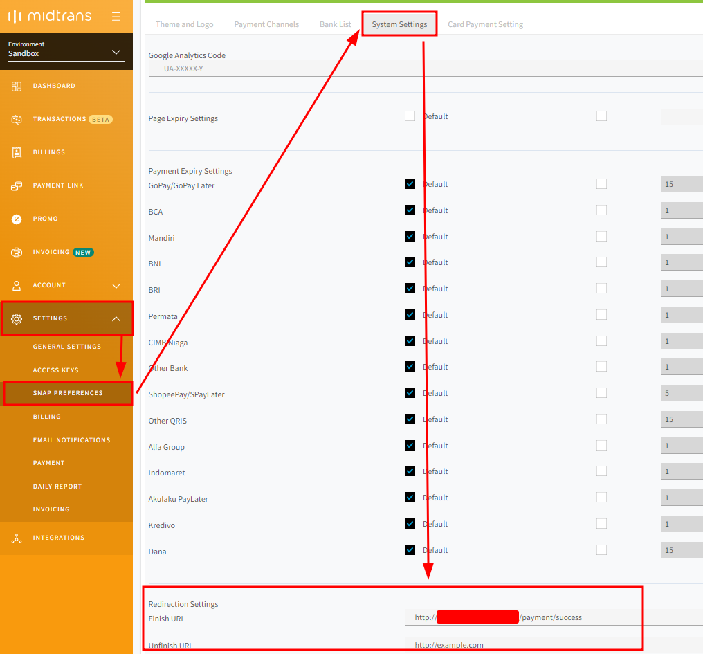

### Install dependency package

```bash
composer install
```

### Generate key

```bash
php artisan key:generate
```

### Running the migration and seeder

```bash
php artisan migrate:fresh --seed
```

### Running the application

> **NOTE**: If you are using laragon pretty url like me, you can skip this part because it already running on local domain because virtual host. But this part will be use for the port forwarding (ngrok or vscode) and testing midtrans payment

```bash
php artisan serve
```

Now you can access the application on `http://localhost:8000`

## Deployment

> **NOTE**: In this deployment I'm using VPS Ubuntu 24.04 LTS on Google Compute Engine. We need to clone the repository before all of the process
>
> ```bash
> git clone https://github.com/armandwipangestu/laracamp-bwa.git ~/laracamp-bwa
> ```

1. First you need to have a web server (I'm using nginx) as a front server, the nginx will forward traffic or pass to process manager php-fpm with fastcgi.

2. You can install nginx latest version with this command:

-   Add GPG

```bash
curl https://nginx.org/keys/nginx_signing.key | gpg --dearmor \
    | sudo tee /usr/share/keyrings/nginx-archive-keyring.gpg >/dev/null
```

-   Add nginx repository

```bash
echo "deb [signed-by=/usr/share/keyrings/nginx-archive-keyring.gpg arch=amd64] \
http://nginx.org/packages/ubuntu `lsb_release -cs` nginx" \
    | sudo tee /etc/apt/sources.list.d/nginx.list
```

-   Update and install nginx

```bash
sudo apt update && sudo apt install nginx
```

3. Setup SSL with Let's encrypt (this is optional, if you want to running with just http you can skip this part)

-   Install snap

```bash
sudo apt install snapd && sudo snap install core && sudo snap refresh core
```

-   Install certbot

```bash
sudo snap install --classic certbot
```

-   Create a symlink for certbot binary

```bash
sudo ln -s /snap/bin/certbot /usr/bin/certbot
```

-   Generate SSL Certificate

> **NOTE**: Change the `DOMAIN` variable with your own configuration, you can fill with domain or subdomain. For example `laracamp-bwa.com` or `laracamp.example.com`

The SSL Certificate will stored at `/etc/letsencrypt/live`

```bash
DOMAIN="laracamp-bwa.com"
sudo certbot certonly --standalone --agree-tos --no-eff-email --staple-ocsp --preferred-challenges http -m noreply@${DOMAIN} -d ${DOMAIN} --pre-hook="systemctl stop nginx" --post-hook="systemctl start nginx"
```

-   Improve SSL security exchanges by creating a Diffle-Helman exchange key

```bash
sudo openssl dhparam -out /etc/ssl/certs/dhparam.pem 2048
```

-   Update nginx configuration

> **NOTE**: Choose what your laravel deployment type:
>
> 1. Running on host (VPS): If your deployment this type, the nginx configuration at `~/laracamp-bwa/nginx/pass-to-host`
> 2. Container (docker compose): If your deployment this type, the nginx configuration at `~/laracamp-bwa/nginx/pass-to-container`

You can update nginx configuration on file `laracamp-ssl.conf` or `laracamp.conf` (if you running with http), then update the domain name `laracamp-bwa.com` with your own domain. For example I will choose container deployment with https

```bash
nvim ~/laracamp-bwa/nginx/pass-to-container/laracamp-ssl.conf
```

-   Check nginx configuration

Make sure the nginx configuration content have this configuration `include /etc/nginx/sites-enabled/*;`. If not you can manually add

```bash
cat /etc/nginx/nginx.conf
```

-   Copy the nginx configuration to `/etc/nginx/sites-available`

Now copy the nginx configuration, for example I will choose container deployment with https

```bash
sudo cp ~/laracamp-bwa/nginx/pass-to-container/laracamp-ssl.conf /etc/nginx/sites-available
```

-   Create a symlink nginx configuration to `/etc/nginx/sites-enabled`

Now create the symlink to enable the configuration

```bash
sudo ln -s /etc/nginx/sites-available/laracamp-ssl.conf /etc/nginx/sites-enabled/laracamp-ssl.conf
```

After create a symlink, you can check the nginx configuration with this command

```bash
sudo nginx -t
```

-   Restart the nginx service

> **NOTE**: Sometimes the nginx got error permission denied to `php8.3-fpm.sock` if your deployment running on host, to fix this you can add uncomment this configuration at `/etc/php/8.3/fpm/pool.d/www.conf`
>
> ```conf
> listen.owner = www-data
> listen.group = www-data
> listen.mode = 0660
> ```
>
> then add permission for user `www-data` to `nginx` group
>
> ```bash
> sudo usermod -aG www-data nginx
> ```
>
> Now restart the service
>
> ```bash
> sudo service php8.3-fpm restart
> ```

```bash
sudo systemctl restart nginx
```

### Container (Docker Compose)

#### Setup Docker

1. Add docker repository

```bash
curl -fsSL https://download.docker.com/linux/ubuntu/gpg | sudo gpg --dearmor -o /usr/share/keyrings/docker-archive-keyring.gpg
echo "deb [arch=$(dpkg --print-architecture) signed-by=/usr/share/keyrings/docker-archive-keyring.gpg] https://download.docker.com/linux/ubuntu $(lsb_release -cs) stable" | sudo tee /etc/apt/sources.list.d/docker.list > /dev/null
```

2. Install docker package

```bash
sudo apt update && apt-cache policy docker-ce && sudo apt install docker-ce
sudo systemctl status docker
```

3. Add current user to docker group

> **NOTE**: This setup will make your current user can run docker without `sudo` command

```bash
sudo usermod -aG docker ${USER} && su - ${USER}
```

4. Install docker compose

```bash
sudo apt update && sudo apt install docker-ce-cli containerd.io docker-compose-plugin docker-compose
docker compose version
```

#### Setup .env before build the image

> **NOTE**: You must be setup your `.env`, you can refer with the localhost setup

```bash
cd ~/laracamp-bwa
cp .env.example .env
```

#### Build and run the container

```bash
docker compose up --build -d
```

#### Setup container app (laravel)

1. Install dependency package

```bash
docker compose exec app composer install
```

2. Generate key

```bash
docker compose exec app php artisan key:generate
```

3. Running the migration and seeder

```bash
docker compose exec app php artisan migrate:fresh --seed
```

Now you can access the application with your own domain

> **NOTE**: If you got an error because permission denied at directory `/var/www/laracamp-bwa/storage` and `/var/www/laracamp-bwa/bootstrap/cache`. You can run this command
>
> ```bash
> docker compose exec app chown -R www-data:www-data /var/www/laracamp-bwa/storage
> docker compose exec app chown -R www-data:www-data /var/www/laracamp-bwa/bootstrap/cache
> ```

### Running on Host or Virtual Private Server (VPS)

#### Update Repository & Upgrade Package

```bash
sudo apt update && sudo apt upgrade
```

#### Install necessary package

```bash
sudo apt install php-mbstring php-xml php-bcmath php-curl php-cli php-fpm php-mysql unzip mariadb-server
```

#### Install composer

```bash
curl -sS https://getcomposer.org/installer -o /tmp/composer-setup.php
HASH=`curl -sS https://composer.github.io/installer.sig` && echo $HASH
php -r "if (hash_file('SHA384', '/tmp/composer-setup.php') === '$HASH') { echo 'Installer verified'; } else { echo 'Installer corrupt'; unlink('composer-setup.php'); } echo PHP_EOL;"
sudo php /tmp/composer-setup.php --install-dir=/usr/local/bin --filename=composer
```

#### Configure MariaDB

1. Change default password for root user

```bash
sudo mariadb -u root -p
```

```sql
ALTER USER 'root'@'localhost' IDENTIFIED BY 'your_secure_password';
FLUSH PRIVILEGES;
```

2. MariaDB secure installation

```bash
mariadb-secure-installation
```

3. Create new database and user

```bash
sudo mariadb -u root -p
```

```sql
CREATE database laracamp_bwa;
CREATE USER user_laracamp_bwa IDENTIFIED BY 'your_secure_password';
GRANT ALL PRIVILEGES ON `laracamp_bwa`.* TO `user_laracamp_bwa`@`%`;
FLUSH PRIVILEGES;
```

#### Configure Laravel

1. Install laravel dependency

> **NOTE**: You must be setup your `.env`, you can refer with the localhost setup

```bash
cd ~/laracamp-bwa && composer install
```

2. Generate key

```bash
php artisan key:generate
```

3. Running the migration and seeder

```bash
php artisan migrate:fresh --seed
```

4. Copy or move project to `/var/www/laracamp-bwa`

```bash
sudo cp -R ~/laracamp-bwa /var/www/laracamp-bwa
```

5. Change the user and group owner permission to `www-data`

```bash
sudo chown -R www-data:www-data /var/www/laracamp-bwa
```

6. Change the permission mode for `storage` and `bootstrap/cache` folder

```bash
sudo chmod -R 755 /var/www/laracamp-bwa/storage
sudo chmod -R 755 /var/www/laracamp-bwa/bootstrap/cache
```

Now your application has been running.

## Git Flow

### Initialize

Start using git-flow by initializing it inside an existing git repository

> **NOTE**: Before running this command, create a new branch for developing the application
>
> ```bash
> git branch development
> ```

```bash
git flow init
```

Now choose the `main` branch as the production release and `development` branch as the development release

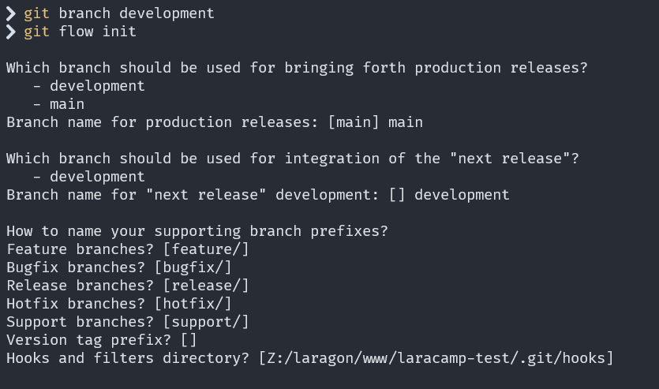

### Creating new feature

If you want to develop new feature for example `payment-gateway` you can create with git flow with this command

```bash
git flow feature start payment-gateway
```

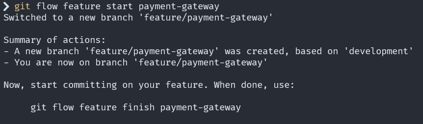

After creating new feature you can start develop the feature

### Finish the feature

If your feature has been develop and finish, now you can merge the branch feature with the development branch with this command

```bash
git flow feature finish payment-gateway
```

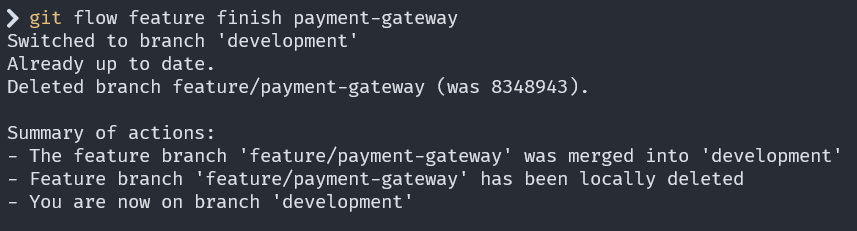

### Create a new release

Everytime you finish the feature you can create a new release based on that code with this command

> **NOTE**: The `v1.1.0` is the release name

```bash
git flow release start v1.1.0
```

### Finish the release

The release has been created, now you can finish the release with this command

```bash
git flow release finish 'v1.1.0'
```

You can add release message for the feature you have been develop, for example `Release Payment Gateway Feature`

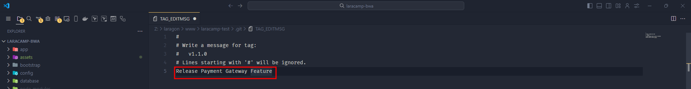

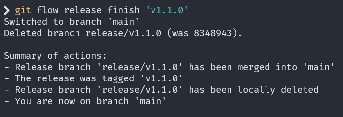

Now you can push the local branch repository to the remote repository (`development` and `main` branch)

But the push will not be create a tag and release on remote repository, to create that you must be push the version tag on local repository using this command

```bash
git push origin v1.1.0
```

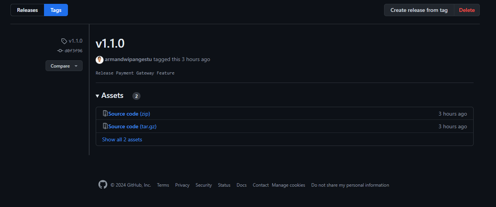

## License

The Laravel framework is open-sourced software licensed under the [MIT license](https://opensource.org/licenses/MIT).
